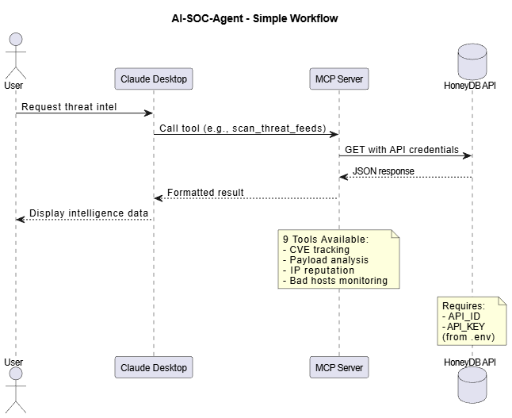

# AI-SOC-Agent

MCP (Model Context Protocol) Server untuk analisis keamanan siber menggunakan HoneyDB API. Server ini menyediakan berbagai tools untuk threat intelligence, analisis CVE, payload analysis, dan IP reputation checking.

## Fitur

- Mencari IP yang mengeksploitasi CVE tertentu
- Melihat riwayat CVE yang dicoba dieksploitasi oleh IP
- Mengambil dan menganalisis payload berbahaya
- Scan IP terhadap berbagai database threat intelligence (Tor, ThreatFox, Project Honeypot, dll)
- Monitoring Bad Hosts dalam 24 jam terakhir
- Pengecekan mendalam IP (Geolocation, ASN, Threat Lists)
- Deteksi Internet Scanner (Shodan/Censys)

## Cara Kerja

AI-SOC-Agent bekerja sebagai MCP Server yang menghubungkan Claude Desktop dengan HoneyDB API. Ketika Anda meminta informasi threat intelligence melalui Claude, server akan memanggil tool yang sesuai, mengambil data dari HoneyDB dengan autentikasi API, lalu mengembalikan hasil dalam format yang mudah dibaca.



Alur sederhana: User bertanya → Claude memanggil tool MCP → Server request ke HoneyDB API → API mengirim data → Server format hasil → Claude tampilkan ke User.

## Persyaratan

- Python 3.10 atau lebih tinggi
- API Key dari HoneyDB (https://honeydb.io/docs/api)

## Setup

### Menggunakan uv (Recommended)

```bash
# Install uv jika belum ada
pip install uv

# Clone repository
git clone <repository-url>
cd AI-SOC-Agent

# Install dependencies dengan uv
uv pip install mcp requests python-dotenv

# Buat file .env dan isi dengan credentials
echo "API_ID=your_api_id" > .env
echo "API_KEY=your_api_key" >> .env
```

### Tanpa uv

```bash
# Clone repository
git clone <repository-url>
cd AI-SOC-Agent

# Buat virtual environment (opsional tapi disarankan)
python -m venv .venv
.venv\Scripts\activate  # Windows
# atau
source .venv/bin/activate  # Linux/Mac

# Install dependencies
pip install mcp requests python-dotenv

# Buat file .env dan isi dengan credentials
echo "API_ID=your_api_id" > .env
echo "API_KEY=your_api_key" >> .env
```

## Konfigurasi

Buat file `.env` di root directory dengan format:

```env
API_ID=your_honeydb_api_id
API_KEY=your_honeydb_api_key
```

## Menjalankan Server

```bash
python server.py
```

## Integrasi dengan Claude Desktop

1. Buka file konfigurasi Claude Desktop:

   - Windows: `%APPDATA%\Claude\claude_desktop_config.json`
   - macOS: `~/Library/Application Support/Claude/claude_desktop_config.json`
   - Linux: `~/.config/Claude/claude_desktop_config.json`

2. Tambahkan konfigurasi berikut (atau copy dari `.docker/mcp/config/claude_desktop_config.json`):

```json
{
  "mcpServers": {
    "ai-soc-agent": {
      "command": "python",
      "args": ["D:\\Project\\MCP\\AI-SOC-Agent\\server.py"],
      "env": {
        "PYTHONUNBUFFERED": "1"
      }
    }
  }
}
```

3. Sesuaikan path di `args` dengan lokasi `server.py` di sistem Anda
4. Restart Claude Desktop

Detail konfigurasi lengkap tersedia di folder `.docker/mcp/`

## Tools yang Tersedia

### find_ips_exploiting_cve

Mencari daftar IP yang terdeteksi mencoba mengeksploitasi CVE tertentu.

### check_cve_history_by_ip

Melihat riwayat CVE yang pernah dicoba dieksploitasi oleh satu IP.

### get_monthly_payload_history

Mengambil riwayat payload berbahaya yang ditangkap pada bulan tertentu.

### analyze_payload_hash

Menganalisis detail payload berdasarkan hash-nya.

### scan_threat_feeds

Scan IP terhadap berbagai database threat intelligence sekaligus.

### get_bad_hosts

Mengambil daftar IP berbahaya yang terdeteksi dalam 24 jam terakhir.

### get_active_services

Melihat services/protokol jaringan yang sedang aktif diserang.

### check_ip_details

Pengecekan mendalam pada satu IP (Geolocation, ASN, Threat Lists).

### check_internet_scanner

Mendeteksi apakah IP tersebut adalah scanner internet yang dikenal.

## Docker

Dockerfile tersedia di folder `.docker/mcp/` untuk deployment menggunakan container.

```bash
# Build Docker image
docker build -t ai-soc-agent -f .docker/mcp/Dockerfile .

# Run container
docker run -d --name ai-soc-agent ai-soc-agent
```

## Lisensi

MIT License
